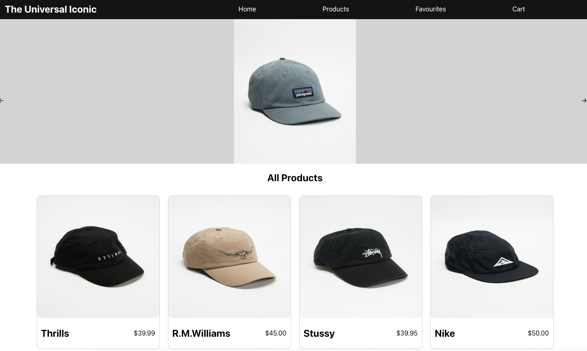

# Ecommerce-Shop

## Contents

-   Description
-   Live Design
-   Stack
-   Setup
-   Approach
-   Challenges
-   Additions

## Description

### Outline

This project is designed to reinforce your React learnings and make sure that you are comfortable with most aspect of the framework. With this project you will practice how to:

-   Fetch Data within a React App
-   Use react-router-dom
-   Use Firebase/Firestore

### MVP

At a minimum your e-shop website should have two pages:

-   Home Page
    -   This will contain:
        -   A Grid of products
        -   Carousel of featured products
        -   Product Page (with id parameter) Similar to a product page on another site, allows you to add to cart and select product variants
-   All products should be stored in Firestore:
    -   You should store the following information:
        -   quantity
        -   variants (could be colors, sizes, etc)
        -   price per unit
        -   name
        -   image url
        -   favourited or not (boolean) All data should be stored in Firestore and fetched by the frontend, there should be NO static product data in the react application

### Bonus

Using Firestore and react create, a cart system. Create a cart page in your react app. Add logic to prevent users from adding items to cart that are no longer in stock. You will have to check the current cart and the product quantity. Cart page should have the following:

-   List of products in cart
    -   Ability to change quantity of products in cart
    -   Ability to remove items from cart

## Live Design

<figure>
<figcaption>Home Page</figcaption>

</figure>

<figure>
<figcaption>Product Page</figcaption>

</figure>

## Stack

-   React.js
-   Firebase/Firestore

## Setup

Click Here to access live demo of application:

🔗 [Live Demo]() - not working yet

## Approach

-   The way I approached this project was by first deciding upon all the container components and all of the visual components I was going to use.

    -   This consisted on a container component for each page (home, products, favourited and cart) of the shop.
    -   the components components consisted of the navbar, carousel, products grid, products card and the product page.

-   After the creation of these pages I set up React-router-dom and created routes for each of these pages which were linked to the navbar links.
-   I then created my database of products using firestore
-   From here I started creating my homepage which was simple up until the point at which I had to generate a grid of products.
    -   To create the grid I fetched the data from the API inside a useffect in the home component and then implemented a map function which created a new Product Card for each firestore document
    -   each of these product cards were also wrapped in a Link which navigated to that products, ProductInfo page.
-   The Products grid was then reused for the products page.
-   The ProductsInfo page was then developed
    -   This consisted of using the useParams hook to give the links functionality.
    -   In additions the api call filtered the documents down to the individual document that matched the id in question
    -   The favourited icon worked by first initiating some state that has an initial boolean value of false.
    -   This state was updated inside an onClick function which gave the opposite boolean value that was currently present
    -   This onclick function also updated the the firestore document to make the favourited category to be equal to whatever the state was equal to.
    -   In addition to the favourited button the add to cart button also had functionality.
    -   for each size of each product there was a intial quantity of 10 units. Whenever the add to cart button was clicked for a certain size, this would update the firestore collection by removing a unit from the quantity map and adding a unit to the cart map.
-   The favourited page worked very similar to that of the products grid, however the firestore collection was filtered for any documents that had a favourited value === true.

## Challenges

-   The major challenge faced was giving the add to cart button functionality.
    -   Initially my approach was going to be to create a new firestore collection and whenever a user clicked add to cart the product in question would be pushed to this new collection.
    -   However I decided to intead create a cart quantity and a stock quantity.
    -   Then for the cart the collection would be filtered for cart quantity > 0.
    -   To make this work I had a switch statement with a case for each of the size allocations.
    -   This switch case updated the firestore collection.
    -   Tis switch case was wrapped in a function which was called when the HTMl form was submitted (add to cart button clicked).
    -   The reason this was challenging was due to the fact that I was struggling to figure a way that would update the required fields when add to cart was clicked.
    -   By stepping back from my code and looking at examples online I realised that a switch statement would fit my needs perfectly.

## Additions

-   Add a cart system
-   Add the ability to favourite an item from its card not just from the product page
-   Make shop more responsive
-   remove unecassary firestore fetchs
-   Refactor repeptitive code
